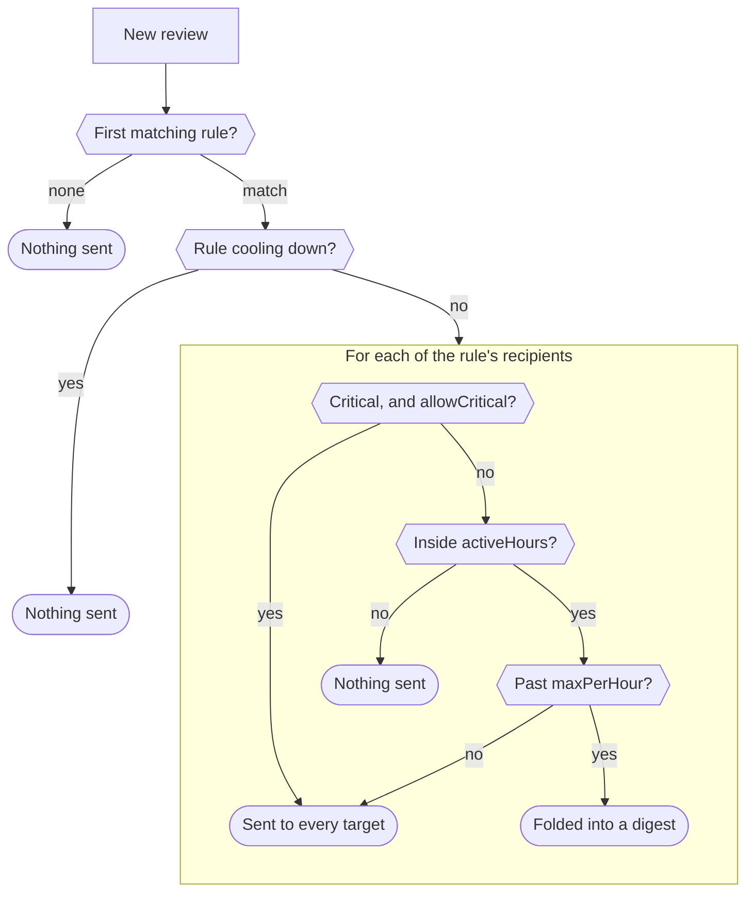

# Configuration

One YAML file sets who gets notified, where, and by which rules.

## Config file

YAML at `CONFIG_PATH` (default `config.yaml`);
[`config-example.yaml`](https://github.com/ConnorsApps/frigate-notifications/blob/main/config-example.yaml)
shows the full shape. Parsing is strict: an unknown key is an error, so a typo
like `sevrity:` can't silently widen a rule.

## Environment variables

| Variable | Default | Description |
|----------|---------|-------------|
| `CONFIG_PATH` | `config.yaml` | Path to the YAML config file |
| `HASS_*`, `MQTT_*`, `MEDIA_*`, `SLACK_BOT_TOKEN`, `NTFY_*`, `REDIS_URL`, `DB_URL`, `TIMEZONE` | — | Override the matching config key (`HASS_URL` → `hass.url`, `MEDIA_SIGNING_KEY` → `media.signingKey`, …), as in the [Compose `.env`](docker-compose.md) |

A non-empty variable overrides the file; an empty one is ignored. Everything
else comes only from the file.

## Cameras

`cameras` lists the Frigate cameras to notify about, with an optional
`friendlyName` for the title. Reviews from a camera that isn't listed are
ignored (logged once as a warning), so at least one is required.

## Rules

Rules are ordered and the first match wins, so **position is priority**. Each
rule ANDs its `when` conditions; each list within one is an OR; anything
omitted matches everything.

```yaml
# yaml-language-server: $schema=https://raw.githubusercontent.com/ConnorsApps/frigate-notifications/main/config.schema.json
rules:
  - name: night-person
    when:
      hours: { from: dusk+30m, to: dawn-30m }
      labels: [person]
      severity: [alert]
      excludeSubLabels: [alice, bob]   # don't alert when it's only household faces
    unless:
      - entityState: { alarm_control_panel.home: disarmed }
      - entityState: { input_boolean.guest_mode: 'on' }
    holdoff: 5s                        # wait for face recognition
    cooldown: 5m
    cooldownScope: rule                # camera (default), rule, or global
    to: [alice, bob]
    preset: liveview                   # auto (default), text, or liveview
    critical: true                     # for recipients with allowCritical
```

### Time windows

`hours` and `activeHours` each take a window:

```yaml
- { from: dusk+30m, to: dawn-30m } # sunrise, sunset, dawn or dusk, ± an offset
- { from: "22:00", to: "06:00" }   # 24-hour, quoted: 06:00 alone is a number
- { from: 9am, to: noon }          # 12-hour, noon or midnight
```

Solar times come from Home Assistant's `sun.sun`, so night rules follow the
seasons. A `to` before `from` wraps midnight. A rule's own `timezone`, if set,
overrides the top-level one for its `hours`.

### `unless`

A list of the same condition blocks as `when`: **any** matching entry
suppresses the rule, and conditions within one entry are ANDed. Use it for "not
when we're home and awake", which sub-label exclusion can't express.
`excludeSubLabels` is for `when` only: under `unless` it would hold when a
stranger is present, so it is rejected.

## Recipient policy

After a rule matches, each recipient's own policy applies, once per person
rather than per target: a phone push and a Slack DM share one hourly cap and
digest.



Each recipient's `targets` are covered in [Backends](notifications.md#backends).
