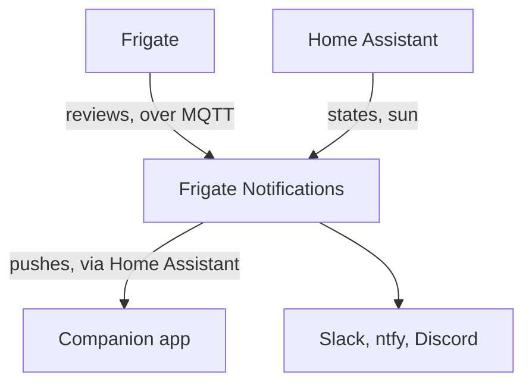
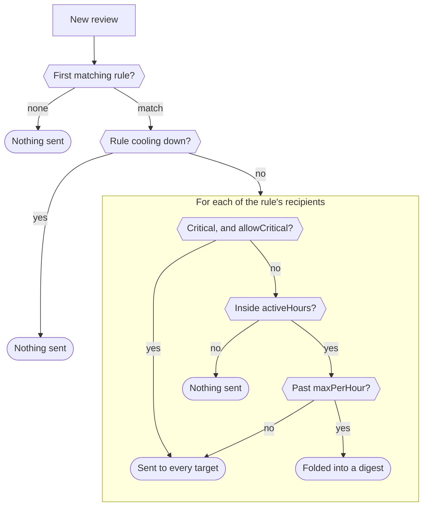
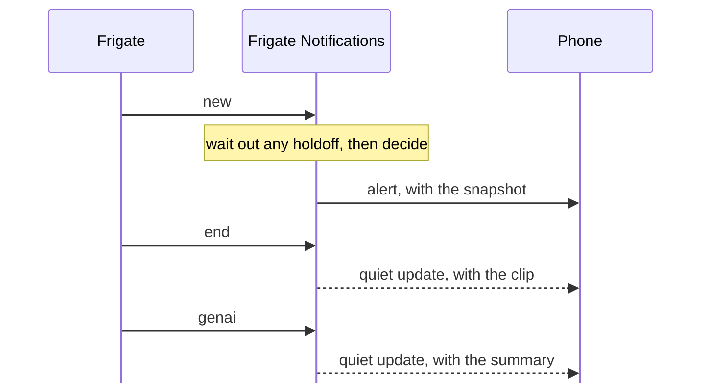
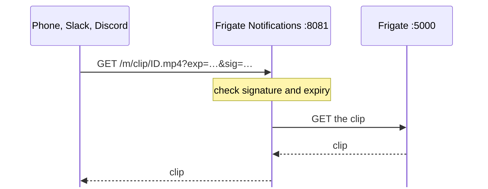
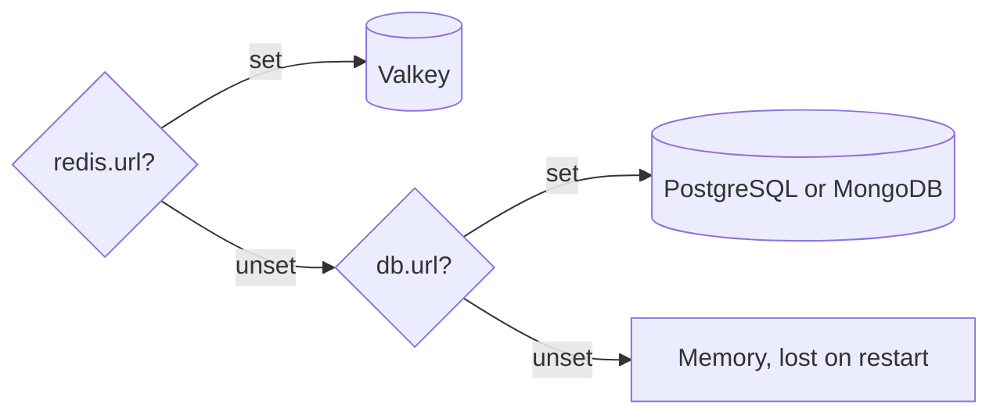

# How it works

## Deciding

## A review's life

One notification per review, updated in place without alerting again:

A later phase alerts again only to raise a review to critical; see
[Lifecycle](notifications.md#lifecycle).

## Media proxy

Notifications can't carry a Frigate login, so their links point at this
service's media port, which fetches from Frigate's unauthenticated API:

- Links are HMAC-signed and expire after `media.linkTTL` (default 24h).
  Rotating `media.signingKey` revokes them all.
- "View Clip" opens a player page: Frigate's HLS where the browser plays it,
  else the mp4.
- Health checks are on :8080, which is never routed publicly.

## State

Cooldowns, review state, rate caps and digests are kept in:

Every store operation fails open: on an error it falls back to memory, so an
outage costs an extra notification, never a missed one. `db.url` also keeps a
year of history, every review and delivery attempt, for
[`cmd/events`](troubleshooting.md#reviewing-what-actually-happened).
