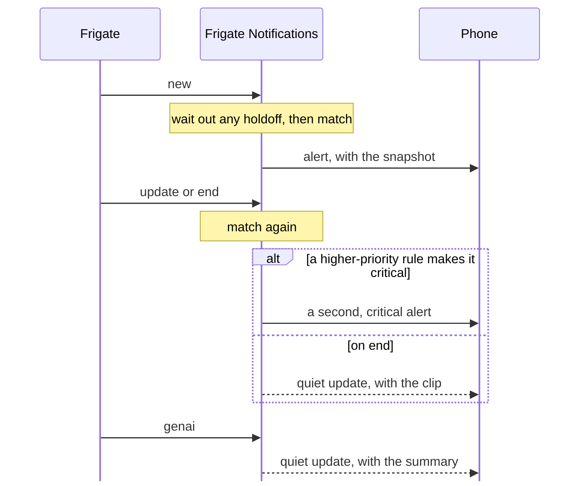

# Notifications

Which apps a notification reaches, what it carries, and how it changes over a
review's life.

## Backends

Each recipient has a list of `targets`, and every target gets each
notification. Targets are delivered concurrently with a 15s timeout each, so a
hung Slack call never delays anything else.

```yaml
recipients:
  alice:
    targets:
      - { type: hass, service: mobile_app_alice_phone }
      - { type: slack, channel: U0123ABCD }   # a channel id, or a user id to DM
      - { type: ntfy, topic: alice-frigate }
      - { type: discord, webhookURL: https://discord.com/api/webhooks/... }
```

| | picture | clip | critical | update (clip ready, GenAI text) |
|---|---|---|---|---|
| `hass` | still as `image` (Android, animated on 14+); the clip, else the still, as an `attachment` (iOS) | "View Clip" action | iOS critical alert, Android `alarm_stream` channel | replaces by `tag`; Android `alert_once`, iOS passive, no sound |
| `ntfy` | snapshot as `attach` | "View Clip" action | priority 5, 🚨 tag | replaces by `sequence_id`, priority 2 |
| `slack` | image block | link in the context line | 🚨 in the header | `chat.update` edits the message |
| `discord` | embed image | link in the embed | red embed, 🚨 in the headline | edits the message |

Every alert carries the camera, what was detected, zones, time, and severity;
an ended review adds its duration and the clip, and a GenAI summary replaces
the headline and adds its sentence. Per backend:

- **`hass`**: grouped per camera, "Alert · Zone" as the iOS subtitle, the review
  start as the Android timestamp. Alerts are time-sensitive on iOS, so they get
  through a Focus mode; detections aren't. Digests use a low-importance
  channel. Android shows no picture away from home if the Companion app's only
  Home Assistant URL is `http://`, unless it allows insecure connections.
- **`ntfy`**: an emoji per object (`walking`, `dog`, `cat`, `car`, `package`,
  else `eyes`; 🚨 when critical); priority 5 critical, 4 alert, 3 detection, 2
  anything quiet. Plain text: iOS doesn't render markdown.
- **`slack`**: the camera as header, the headline in bold, then the picture and
  a context line with time (in the viewer's timezone), duration, zones and
  links. The push preview is "Camera: headline".
- **`discord`**: the headline is the message text, since push previews show the
  text, not the embed; the embed carries the detail, picture, a footer (zones,
  severity, duration) and the start time. Digests post without a notification.

Only `hass` bypasses Do Not Disturb; elsewhere "critical" is styling.
`allowCritical` still decides who gets the critical form. `hass:` is required
even for chat-only setups: rule conditions (`entityState`, solar hours) read
Home Assistant state.

**Slack.** Create an app with a bot token (`chat:write`) and set
`slack.botToken`. Invite the bot to each channel, or grant `chat:write.public`,
or posts fail with `not_in_channel`. A user id opens a DM. It must be a bot,
not an incoming webhook: only bots can edit messages.

**ntfy.** Set `ntfy.url`, plus `ntfy.token` if the server needs one.

- Updating in place needs **ntfy server ≥ 2.16** and Android app ≥ 1.22.2;
  older servers send each update as a second notification. The iOS app never
  replaces: an update arrives as a second, passive notification.
- It attaches the snapshot, not the gif: Android auto-downloads only up to
  1 MB by default.
- A self-hosted server needs `upstream-base-url: https://ntfy.sh` for instant
  delivery to iOS.
- Authenticate with an access token (`tk_...`) for a write-only user on the
  topic, with `auth-default-access: deny-all` on the server.

**Discord.** The webhook URL is the whole credential: treat it like a token. It
is never logged, traced, or written to the audit log (only its id is).

**Reachability and privacy.** Slack and Discord fetch snapshots from the
[media proxy](how-it-works.md#media-proxy) themselves, so
`media.publicBaseURL` must be reachable from their servers, not just phones.
Both cache what they fetch: a snapshot posted to a channel outlives its signed
link and is visible to everyone there.

GenAI text is escaped for Slack and Discord markup, with Discord mentions
disabled, so a description can't ping a channel or restyle a message.

## Media and presets

Media is picked automatically: each candidate is probed against Frigate, and
the first that exists and fits wins; if none does, the push is text. The clip,
best still (preview gif, else snapshot) and snapshot are resolved
independently, and each backend shows what it can (see [Backends](#backends)).

| phase | order tried |
|---|---|
| `new` | snapshot → text |
| `end` | clip (≤25 MB), then the first still that fits: review preview gif (≤10 MB) → snapshot; text if neither |

The clip spans the whole review, from 2s before to 3s after. Its cap is below
iOS's 50 MB limit because the notification extension has ~30 s to download it.
A clip too big to attach is still linked from "View Clip", which opens a
[player page](how-it-works.md#media-proxy).

H.265 cameras need Frigate's `ffmpeg: {apple_compatibility: true}`, or their
clips are tagged `hev1`, which iOS won't play (`notify-test --check-media`
reports the tag).

`preset` is optional and only overrides that:

| preset | effect |
|---|---|
| `auto` (default) | the selection above |
| `text` | no attachment (the "View Clip" action is still offered) |
| `liveview` | `auto`, plus the camera's `liveViewEntity` for an iOS live stream on expand, until the clip exists (iOS would show the camera over it) |

`frigate_notify_media_selected_total{phase,kind}` counts what each notification
carried; `kind="none"` means every candidate failed and it fell back to text
(`off` is `preset: text`). Check it first when images stop showing up.

## Lifecycle

Frigate reports a review as it starts, changes and ends, then once more with
its GenAI summary (Frigate ≥ 0.17, `review.genai` on). One notification follows
it, updated in place:



- Any phase can send the first alert, so a review Frigate raises from
  `detection` to `alert` can still fire a `severity: [alert]` rule.
- A higher-priority rule that only adds detail, like a zone or a face,
  refreshes in place; a lower-priority match never demotes a critical alert.
- Updates are quiet on every [backend](#backends). A critical review's update
  drops the critical push: iOS can't replace one, and would ring twice.
- GenAI threat level 1 prefixes "Needs review:", and 2 "Security concern:".
  It's shown, never acted on.

`holdoff` exists because face recognition lags: `sub_labels` is usually empty
on `new`, and a push can't be recalled. Rules with `labels: [person]` or a
sub-label condition wait 5s by default, then decide on the newest payload; an
`end` during the wait decides at once.
